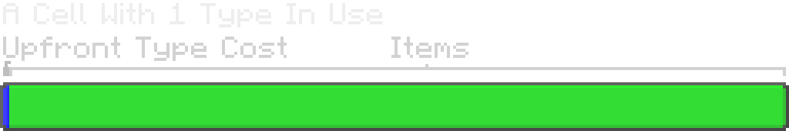
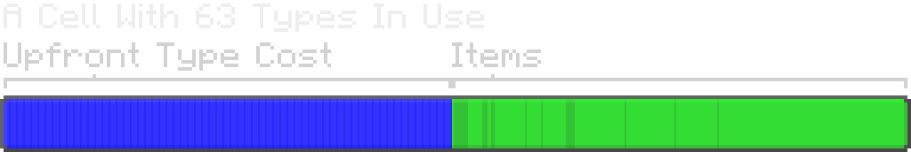

---
navigation:
  parent: ae2-mechanics/ae2-mechanics-index.md
  title: バイトとタイプ
  icon: creative_storage_cell
---

# バイトとタイプ

<Row>
    <ItemImage id="item_storage_cell_1k" scale="4" />

    <ItemImage id="item_storage_cell_4k" scale="4" />

    <ItemImage id="item_storage_cell_16k" scale="4" />

    <ItemImage id="item_storage_cell_64k" scale="4" />

    <ItemImage id="item_storage_cell_256k" scale="4" />
</Row>

[ストレージセル](../items-blocks-machines/storage_cells.md)は*バイト*と*タイプ*の両方によって定義されます。バイトは、実際のコンピュータと同様に、ストレージセル内に保存される「データ量（ものの総量）」を表します。タイプは、そのセルに保存されている「異なる種類（タイプ）の数」を表します。各タイプはユニークなアイテムを意味するため、例えば4096個の丸石は1タイプですが、エンチャントや状態が異なる16本の剣は16タイプとして扱われます。

各ストレージセルは固定量のデータを保持できます。各タイプは最初に一定のバイト数を消費し（これはセルサイズによって変化します）、さらに各アイテムは1ビットのストレージを消費します。そのため8個のアイテムで1バイト、64個フルスタックで8バイトを消費します。これはMEネットワーク外でのスタック可能性とは無関係です。例えば、64個の同じサドルは64個の石と同じ容量しか使いません。

繰り返しになりますが、各アイテムは1ビットであり、8アイテムで1バイトです。液体セルの場合は、1バイトあたり8バケットです。

多くの人がセルのタイプ上限を不便だと感じますが、これは***必要な制約***です。セルはそのデータをアイテム自体のNBTタグに保存しているため、非常に安定しています。しかしデータ量が過剰になると、プレイヤーへ送信されるデータ量が増え、バニラMinecraftの「本BAN」に似た現象を引き起こす可能性があります。また、タイプ数が増えるとソートやアイテム処理の負荷も増加します。ただし、この制限は実際にはそれほど厳しくありません。<ItemLink id="drive" />1台分のセルで630タイプ保持できるため、ユニークな非スタックアイテムを大量に扱わない限り十分です。

そのためタイプ制限は、モブファームから出る耐久値やエンチャントがバラバラの防具・道具をそのままMEシステムに流し込むことを「強く抑制する」役割を持っています。各アイテムは別エントリとして保存されるため、データが膨張します。システムに入る前にフィルタリングすることが推奨されます。

最上位セルを無条件で目指すのは一般的に最善ではありません。リソース消費は増えますがタイプ容量は増えないためです。つまり、すべてのサイズのセルにはそれぞれ価値があり、ゲーム後半でも役割があります。

以下は各ストレージセルの比較表で、容量とおおよそのコストを示しています。

## ストレージセル内容量とコスト比較

| セル                                     |   バイト | タイプ | バイト/タイプ | Certus | レッドストーン | 金 | グロウストーン |
| ---------------------------------------- | ------: | ----: | ------------: | -----: | ------------: | --: | ------------: |
| <ItemLink id="item_storage_cell_1k" />   |   1,024 |    63 |             8 |      4 |             5 |   1 |             0 |
| <ItemLink id="item_storage_cell_4k" />   |   4,096 |    63 |            32 |  14.25 |            20 |   3 |             0 |
| <ItemLink id="item_storage_cell_16k" />  |  16,384 |    63 |           128 |     45 |            61 |   9 |             4 |
| <ItemLink id="item_storage_cell_64k" />  |  65,536 |    63 |           512 | 137.25 |           184 |  27 |            16 |
| <ItemLink id="item_storage_cell_256k" /> | 262,144 |    63 |          2048 |    414 |           553 |  81 |            48 |

## タイプ数による容量の変化

タイプの初期コストの影響により、1タイプしか使っていないセルは、63タイプフル使用のセルの約2倍の容量を持つことができます。

| セル                                     | タイプ1使用時の総容量 | タイプ63使用時の総容量 |
| ---------------------------------------- | -------------------: | ---------------------: |
| <ItemLink id="item_storage_cell_1k" />   |                8,128 |                 4,160 |
| <ItemLink id="item_storage_cell_4k" />   |               32,512 |                16,640 |
| <ItemLink id="item_storage_cell_16k" />  |              130,048 |                66,560 |
| <ItemLink id="item_storage_cell_64k" />  |              520,192 |               266,240 |
| <ItemLink id="item_storage_cell_256k" /> |            2,080,768 |             1,064,960 |

