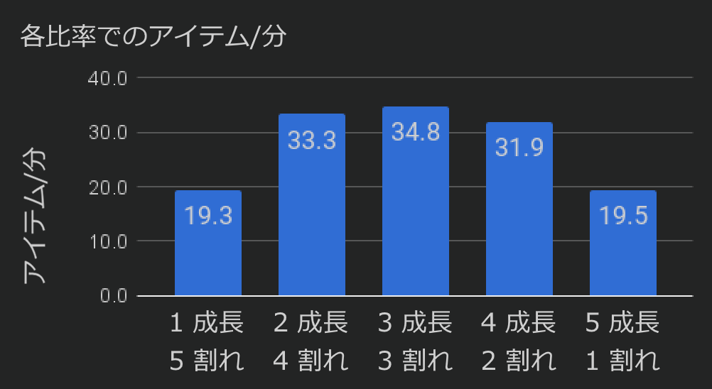
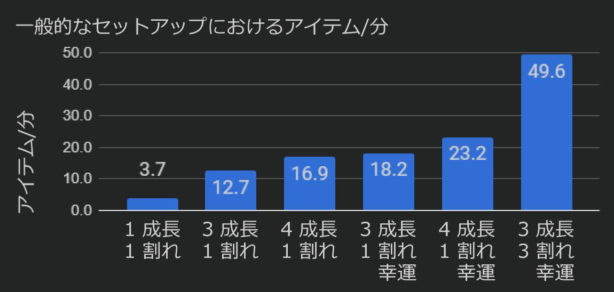

---
navigation:
  parent: ae2-mechanics/ae2-mechanics-index.md
  title: ケルタスの成長
  icon: quartz_cluster
---

# ケルタスの成長

## ほぼ「はじめに」ページからのコピペ

<GameScene zoom="6" background="transparent">
<ImportStructure src="../assets/assemblies/budding_certus_1.snbt" />
</GameScene>

ケルタス（Certus）クォーツの芽は、アメジストと同様に[芽生えたケルタスクォーツブロック](../items-blocks-machines/budding_certus.md)から成長します。まだ成長途中の芽を壊すと、<ItemLink id="certus_quartz_dust" />を1個ドロップします（幸運による変化はありません）。完全に成長した水晶を壊すと、<ItemLink id="certus_quartz_crystal" />を4個ドロップし、幸運によってこの数は増加します。

芽生えたケルタスクォーツブロックには4段階のティアがあります。完璧な、傷ついた、欠けた、壊れかけのです。これらは最初は[隕石](../ae2-mechanics/meteorites.md)から見つかります。

<GameScene zoom="4" background="transparent">
  <ImportStructure src="../assets/assemblies/budding_blocks.snbt" />
  <IsometricCamera yaw="195" pitch="30" />
</GameScene>

芽が成長して次の段階へ進むたびに、その芽生えたブロックは1段階劣化する可能性があります。最終的には通常のケルタスクォーツブロックになります。これらは、水の中で1つ以上の<ItemLink id="charged_certus_quartz_crystal" />と一緒に投げ込むことで修復（および新規作成）できます。

<RecipeFor id="damaged_budding_quartz" />

完璧な芽生えたケルタスクォーツブロックは劣化せず、無限にケルタスを生成します。ただしこれらはクラフトできず、ツルハシ（シルクタッチを含む）でも回収できません。（ただし[空間ストレージ](../ae2-mechanics/spatial-io.md)では移動可能です）

単体では、ケルタスクォーツの芽の成長は非常に遅いです。幸いにも<ItemLink id="growth_accelerator" />を隣接させることで、この成長速度は大幅に加速されます。これは最初に作るべき重要な装置の一つです。

<GameScene zoom="4" background="transparent">
  <ImportStructure src="../assets/assemblies/budding_certus_2.snbt" />
  <IsometricCamera yaw="195" pitch="30" />
</GameScene>

複雑な相互作用により、芽生えたブロックの各面が覆われているほど累積成長速度は低下します。そのため、増やしすぎた加速器の効果を最終的に打ち消すことになります。実測では以下のような傾向が確認されています：

もしケルタスが十分になく、<ItemLink id="energy_acceptor" />や<ItemLink id="vibration_chamber" />も作れない場合は、<ItemLink id="crank" />を作って加速器の端に取り付けることで代用できます。

ケルタスの自動収穫については[こちらで解説されています](../example-setups/simple-certus-farm.md)。
