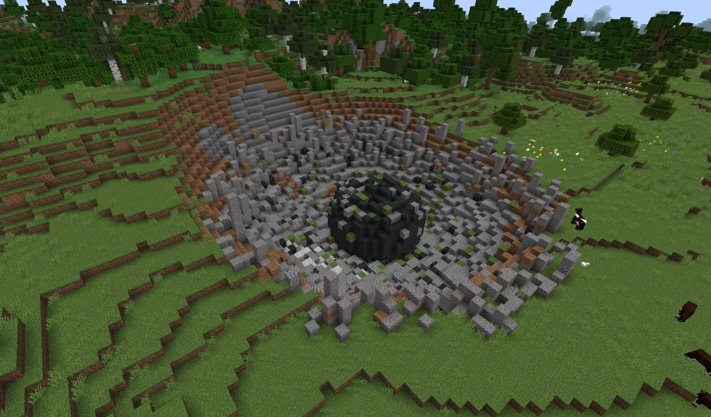

---
navigation:
  parent: ae2-mechanics/ae2-mechanics-index.md
  title: 隕石
  icon: sky_stone_block
---

# 隕石

<GameScene zoom="4" background="transparent">
  <ImportStructure src="../assets/assemblies/meteor_interior.snbt" />
</GameScene>

隕石はAE2を始める際の出発点です。ここでは重要な素材である、さまざまな種類の[芽生えたサートスブロック](../items-blocks-machines/budding_certus.md)や、中央にある<ItemLink id="mysterious_cube" />を入手できます。

次に何をすべきかについては、[はじめに](../getting-started.md)を参照してください。

## 隕石の発見

隕石は比較的一般的であり、大きな地形の穴として見つかるため、すでにいくつか見つけているかもしれません。もしまだ見つけていない場合は、<ItemLink id="meteorite_compass" />が最も近いミステリアスキューブの方向を指し示します。

