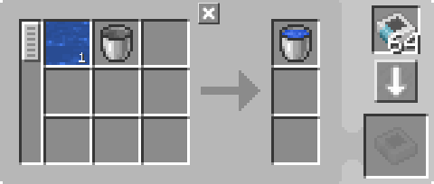
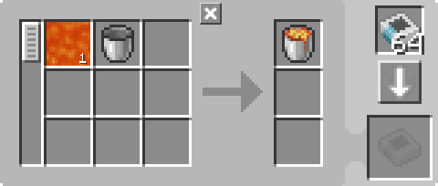

---
navigation:
  parent: example-setups/example-setups-index.md
  title: バケツ充填装置
  icon: minecraft:water_bucket
---

# バケツ充填装置

[バケツ空化装置](bucket-emptier.md)も参照してください。

この構成は<ItemLink id="pattern_provider" />を使用するため、[自動クラフト](../ae2-mechanics/autocrafting.md)システムへの統合を前提としています。

場合によっては、液体そのものではなく「バケツ入りの液体」が必要になることがあります。Thermal ExpansionのFluid Transposerのように便利な装置もありますが、常にそうしたMODがあるとは限りません。その場合に使えるのが、バニラMinecraftのやや不便な方法である<ItemLink id="minecraft:dispenser" />です。

**ただし多くの場合、この構成は不要です。というのも、[パターンエンコーディングターミナル](../items-blocks-machines/terminals.md#pattern-encoding-terminal)のフルイド代替機能により、レシピ内でバケツではなく液体そのものを使用できます。**

<GameScene zoom="6" interactive={true}>
  <ImportStructure src="../assets/assemblies/bucket_filler.snbt" />

<BoxAnnotation color="#dddddd" min="2 1 0" max="3 2 1">
        (1) パターンプロバイダ：クラフトを「レッドストーン信号でロック」に設定し、対応するプロセッシングパターンを使用

        <Row>
        
        
        </Row>
  </BoxAnnotation>

<BoxAnnotation color="#dddddd" min="3 1.1 0.1" max="3.2 1.9 0.9">
        (2) MEインターフェース：デフォルト設定
  </BoxAnnotation>

<BoxAnnotation color="#dddddd" min="3.1 1.1 0.8" max="3.9 1.9 1">
        (3) MEストレージバス #1：デフォルト設定
  </BoxAnnotation>

<BoxAnnotation color="#dddddd" min="4.05 1.05 0.8" max="4.95 1.95 1">
        (4) ME形成プレーン：バケツをブラックリスト（インバートカード使用）
        <Row><ItemImage id="minecraft:bucket" scale="2" /><ItemImage id="inverter_card" scale="2" /></Row>
  </BoxAnnotation>

<BoxAnnotation color="#dddddd" min="3.2 2 1.2" max="3.8 2.2 1.8">
        (5) MEインポートバス：バケツをブラックリスト（インバートカード使用）
        <Row><ItemImage id="minecraft:bucket" scale="2" /><ItemImage id="inverter_card" scale="2" /></Row>
  </BoxAnnotation>

<BoxAnnotation color="#dddddd" min="2.1 2 0.1" max="2.9 2.2 0.9">
        (6) MEストレージバス #2：デフォルト設定
  </BoxAnnotation>

<DiamondAnnotation pos="0 1.5 0.5" color="#00ff00">
        メインネットワークへ接続
    </DiamondAnnotation>

  <IsometricCamera yaw="225" pitch="45" />
</GameScene>

## 構成

* <ItemLink id="pattern_provider" />（1）は「レッドストーン信号でロック」に設定され、対応する<ItemLink id="processing_pattern" />を使用
* <ItemLink id="interface" />（2）はデフォルト設定
* 最初の<ItemLink id="storage_bus" />（3）はデフォルト設定
* <ItemLink id="formation_plane" />（4）はバケツをブラックリスト（インバートカード使用）
  <Row><ItemImage id="minecraft:bucket" scale="2" /><ItemImage id="inverter_card" scale="2" /></Row>
* <ItemLink id="import_bus" />（5）はバケツをブラックリスト（インバートカード使用）
  <Row><ItemImage id="minecraft:bucket" scale="2" /><ItemImage id="inverter_card" scale="2" /></Row>
* 2つ目の<ItemLink id="storage_bus" />（6）はデフォルト設定

## 動作原理

1. <ItemLink id="pattern_provider" />が材料を<ItemLink id="interface" />へ送信します
   （実際には最適化によりMEストレージバスやME形成プレーンを経由して直接処理され、MEインターフェースを通過しない場合があります）
2. [パイプサブネット](pipe-subnet.md#providing-to-multiple-places)と<ItemLink id="formation_plane" />の仕組みにより、バケツは<ItemLink id="minecraft:dispenser" />へ送られ、同時にME形成プレーンが液体を設置します
3. <ItemLink id="minecraft:comparator" />がディスペンサー内のバケツを検出し、ディスペンサーを作動させると同時にパターンプロバイダをロックします
4. ディスペンサーが液体をバケツで回収し、満たされたバケツになります
5. <ItemLink id="import_bus" />がディスペンサーからバケツを回収し、<ItemLink id="storage_bus" />経由でメインネットワークへ戻します
6. コンパレータがディスペンサーが空であることを検出し、プロバイダのロックを解除します
