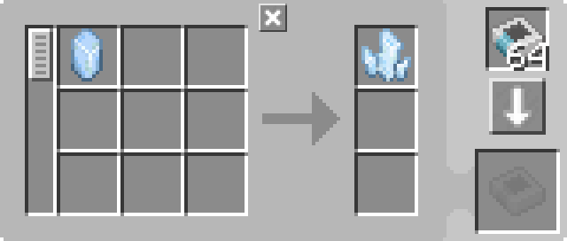

---
navigation:
  parent: example-setups/example-setups-index.md
  title: チャージャー自動化
  icon: charger
---

# チャージャー自動化

この構成は<ItemLink id="pattern_provider" />を使用するため、[自動クラフト](../ae2-mechanics/autocrafting.md)への統合を前提としています。単体で<ItemLink id="charger" />を自動化したいだけなら、ホッパーやチェストなどの方が簡単です。

<ItemLink id="charger" />の自動化は比較的シンプルです。<ItemLink id="pattern_provider" />が材料をチャージャーへ送り、その後[パイプサブネット](pipe-subnet.md)または別のアイテム輸送手段が結果をプロバイダへ戻します。

<GameScene zoom="6" interactive={true}>
  <ImportStructure src="../assets/assemblies/charger_automation.snbt" />

<BoxAnnotation color="#dddddd" min="1 0 0" max="2 1 1">
        (1) パターンプロバイダ：デフォルト設定、対応するプロセッシングパターンを使用。チャージャーへの電力供給も行う

        
  </BoxAnnotation>

<BoxAnnotation color="#dddddd" min="0 1 0" max="1 1.3 1">
        (2) インポートバス：デフォルト設定
  </BoxAnnotation>

<BoxAnnotation color="#dddddd" min="1 1 0" max="2 1.3 1">
        (3) ストレージバス：デフォルト設定
  </BoxAnnotation>

<DiamondAnnotation pos="4 0.5 0.5" color="#00ff00">
        メインネットワークへ接続
    </DiamondAnnotation>

  <IsometricCamera yaw="195" pitch="30" />
</GameScene>

## 構成

* <ItemLink id="pattern_provider" />（1）はデフォルト設定で、対応する<ItemLink id="processing_pattern" />を使用します
  また、ケーブルとして扱われるためチャージャーへ[エネルギー](../ae2-mechanics/energy.md)も供給します

  

* <ItemLink id="import_bus" />（2）はデフォルト設定
* <ItemLink id="storage_bus" />（3）はデフォルト設定

## 動作原理

1. <ItemLink id="pattern_provider" />が材料を<ItemLink id="charger" />へ送信します
2. チャージャーが充電処理を実行します
3. 緑色サブネット上の<ItemLink id="import_bus" />がチャージ後の結果を取り出し、[ネットワークストレージ](../ae2-mechanics/import-export-storage.md)へ送ろうとします
4. 緑色サブネットの唯一のストレージである<ItemLink id="storage_bus" />がそれを受け取り、最終的にパターンプロバイダへ戻すことでメインネットワークへ返送されます
