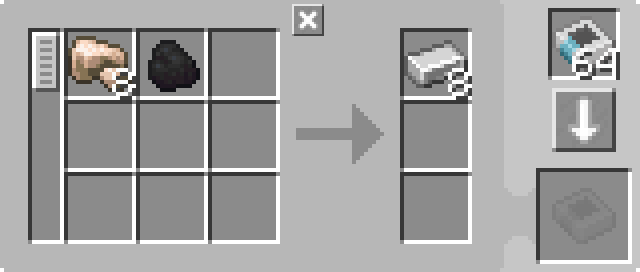

---
navigation:
  parent: example-setups/example-setups-index.md
  title: かまど自動化
  icon: minecraft:furnace
---

# かまど自動化

この構成は<ItemLink id="pattern_provider" />を使用するため、[自動クラフト](../ae2-mechanics/autocrafting.md)システムへの統合を前提としています。単体でかまどを自動化したい場合は、ホッパーやチェストの方がシンプルです。

<ItemLink id="minecraft:furnace" />の自動化は、チャージャーのような単純な機械より少し複雑です。かまどは入力が複数の面に分かれており、さらに出力用の面も必要になります。具体的には、上面から精錬対象、側面から燃料、下面から結果を取り出します。

これを素直に構成すると、上面に<ItemLink id="pattern_provider" />、側面に燃料供給用の<ItemLink id="export_bus" />、下面に結果回収用の<ItemLink id="import_bus" />が必要となり、合計で3チャネルを使用します。

しかし、以下の構成では1チャネルで実現できます。

<GameScene zoom="6" interactive={true}>
  <ImportStructure src="../assets/assemblies/furnace_automation.snbt" />

<BoxAnnotation color="#dddddd" min="1 0 0" max="2 1 1">
        (1) パターンプロバイダ：サーティスクォーツレンチで方向指定されたバリアント。対応するプロセッシングパターンを使用

        
  </BoxAnnotation>

<BoxAnnotation color="#dddddd" min="1 1 0" max="2 1.3 1">
        (2) インターフェース：デフォルト設定
  </BoxAnnotation>

<BoxAnnotation color="#dddddd" min="1 1 0" max="1.3 2 1">
        (3) ストレージバス #1：石炭にフィルタリング
        <ItemImage id="minecraft:coal" scale="2" />
  </BoxAnnotation>

<BoxAnnotation color="#dddddd" min="0 2 0" max="1 2.3 1">
        (4) ストレージバス #2：石炭をブラックリスト（インバートカード使用）
        <Row><ItemImage id="minecraft:coal" scale="2" /><ItemImage id="inverter_card" scale="2" /></Row>
  </BoxAnnotation>

<DiamondAnnotation pos="4 0.5 0.5" color="#00ff00">
        メインネットワークへ接続
    </DiamondAnnotation>

  <IsometricCamera yaw="195" pitch="30" />
</GameScene>

## 構成

* <ItemLink id="pattern_provider" />（1）はデフォルト設定で、対応する<ItemLink id="processing_pattern" />を使用します
  サーティスクォーツレンチで方向指定されています

  

* <ItemLink id="interface" />（2）はデフォルト設定
* 最初の<ItemLink id="storage_bus" />（3）は燃料（例：石炭）にフィルタリング
* 2つ目の<ItemLink id="storage_bus" />（4）は燃料をブラックリスト（インバートカード使用）で除外

## 動作原理

1. <ItemLink id="pattern_provider" />が材料を<ItemLink id="interface" />へ送信します
   （実際には最適化によりストレージバス経由で直接供給され、インターフェースを通らない場合があります）
2. インターフェースは何も保持しない設定のため、入力を[ネットワークストレージ](../ae2-mechanics/import-export-storage.md)へ送ろうとします
3. サブネット上の唯一のストレージであるストレージバス群がそれを受け取り、かまどの各面へ適切に供給します
   * 燃料用ストレージバスは側面から燃料スロットへ供給
   * ブラックリスト側のストレージバスは上面から精錬スロットへ供給
4. かまどが精錬処理を実行します
5. 下面からホッパーが結果を回収し、プロバイダの返却スロットへ戻すことでメインネットワークへ返送されます
