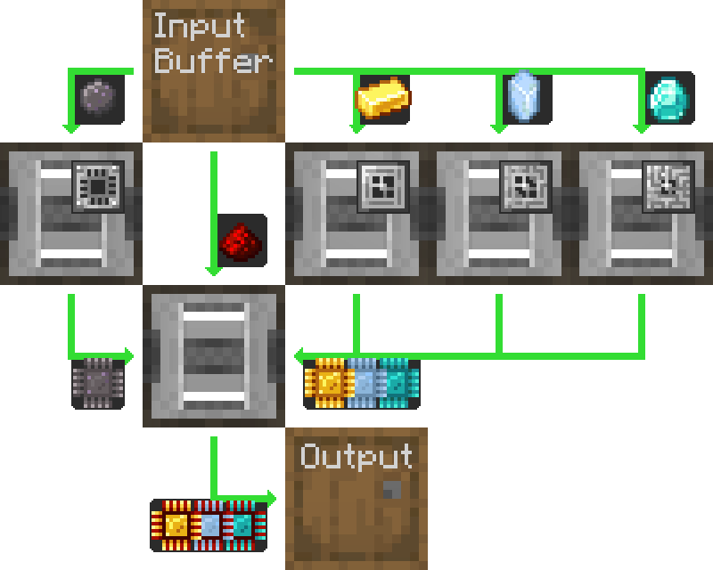
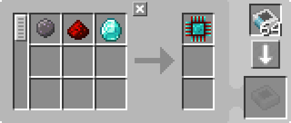

---
navigation:
  parent: example-setups/example-setups-index.md
  title: プロセッサ自動化
  icon: logic_processor
---

# プロセッサ生産の自動化

[プロセッサ](../items-blocks-machines/processors.md)を自動化する方法は多数ありますが、ここではその一例を紹介します。

この基本レイアウトは、フィルタリング可能なアイテム物流パイプ・コンジット・ダクトなど、モッドが何と呼んでいるものであっても実現できます。

ここではAE2のみを使用し、["パイプ"サブネット](pipe-subnet.md)を使った方法を詳しく説明します。

この構成は<ItemLink id="pattern_provider" />を使用するため、[自動クラフト](../ae2-mechanics/autocrafting.md)システムへの統合を前提としています。
もし単独でプロセッサを自動化したいだけなら、パターンプロバイダを別のバレルに置き換え、材料を直接上側のバレルに入れてください。

この方法は旧バージョンのAE2とも互換性があります。なぜなら<ItemLink id="inscriber" />は側面指定されていても、パイプサブネットが正しい面へ出し入れを行うためです。

## パターンエンコードの理解

多くの場合、[パターン](../items-blocks-machines/patterns.md)のエンコード結果は**JEIに表示される内容と一致しません**。または、JEIで「+」ボタンを押したときの出力とも一致しません。

この場合、JEIは2つの別々のパターンを生成します：
1つはプリント部品用、もう1つは最終組立用です。さらにプリント部品のパターンには[プレス](../items-blocks-machines/presses.md)が含まれます。

しかしこれは望ましい形式ではありません。なぜなら、この構成ではプレスはすでにインスcriber内に存在するからです。
したがって、必要なのは「原材料 → 完成プロセッサ」の1つのパターンであり、プレスはパターンに含めるべきではありません。

---

<GameScene zoom="4" interactive={true}>
  <ImportStructure src="../assets/assemblies/processor_automation.snbt" />

  <BoxAnnotation color="#dddddd" min="5 1 0" max="6 2 1" thickness=".05">
        (1) パターンプロバイダ：デフォルト設定。関連する処理パターンを保持。
        <Row>
            
            
            
        </Row>
  </BoxAnnotation>

  <BoxAnnotation color="#dddddd" min="4.7 2 0" max="5 3 1" thickness=".05">
        (2) ストレージバス #1：デフォルト設定
  </BoxAnnotation>

  <BoxAnnotation color="#dddddd" min="4 1 0" max="4.3 2 1" thickness=".05">
        (3) エクスポートバス #1：シリコンにフィルタ設定、加速カード2枚
        <Row><ItemImage id="silicon" scale="2" /> <ItemImage id="speed_card" scale="2" /></Row>
  </BoxAnnotation>

  <BoxAnnotation color="#dddddd" min="4 4 0" max="4.3 3 1" thickness=".05">
        (4) エクスポートバス #2：金インゴットにフィルタ設定、加速カード2枚
        <Row><ItemImage id="minecraft:gold_ingot" scale="2" /> <ItemImage id="speed_card" scale="2" /></Row>
  </BoxAnnotation>

  <BoxAnnotation color="#dddddd" min="4 5 0" max="4.3 4 1" thickness=".05">
        (5) エクスポートバス #3：純粋なクォーツ結晶にフィルタ設定、加速カード2枚
        <Row><ItemImage id="certus_quartz_crystal" scale="2" /> <ItemImage id="speed_card" scale="2" /></Row>
  </BoxAnnotation>

  <BoxAnnotation color="#dddddd" min="4 6 0" max="4.3 5 1" thickness=".05">
        (6) エクスポートバス #4：ダイヤモンドにフィルタ設定、加速カード2枚
        <Row><ItemImage id="minecraft:diamond" scale="2" /> <ItemImage id="speed_card" scale="2" /></Row>
  </BoxAnnotation>

  <BoxAnnotation color="#dddddd" min="2.3 3 0" max="2 2 1" thickness=".05">
        (7) エクスポートバス #5：レッドストーンダストにフィルタ設定、加速カード2枚
        <Row><ItemImage id="minecraft:redstone" scale="2" /> <ItemImage id="speed_card" scale="2" /></Row>
  </BoxAnnotation>

  <BoxAnnotation color="#dddddd" min="4 1 0" max="3 2 1" thickness=".05">
        (8) インスcriber #1：シリコンプレスと加速カード4枚
        <Row><ItemImage id="silicon_press" scale="2" /> <ItemImage id="speed_card" scale="2" /></Row>
  </BoxAnnotation>

  <BoxAnnotation color="#dddddd" min="4 3 0" max="3 4 1" thickness=".05">
        (9) インスcriber #2：ロジックプレスと加速カード4枚
        <Row><ItemImage id="logic_processor_press" scale="2" /> <ItemImage id="speed_card" scale="2" /></Row>
  </BoxAnnotation>

  <BoxAnnotation color="#dddddd" min="4 4 0" max="3 5 1" thickness=".05">
        (10) インスcriber #3：計算プレスと加速カード4枚
        <Row><ItemImage id="calculation_processor_press" scale="2" /> <ItemImage id="speed_card" scale="2" /></Row>
  </BoxAnnotation>

  <BoxAnnotation color="#dddddd" min="4 5 0" max="3 6 1" thickness=".05">
        (11) インスcriber #4：エンジニアリングプレスと加速カード4枚
        <Row><ItemImage id="engineering_processor_press" scale="2" /> <ItemImage id="speed_card" scale="2" /></Row>
  </BoxAnnotation>

  <BoxAnnotation color="#dddddd" min="2 2 0" max="1 3 1" thickness=".05">
        (12) インスcriber #5：加速カード4枚
        <ItemImage id="speed_card" scale="2" />
  </BoxAnnotation>

  <BoxAnnotation color="#dddddd" min="2.7 2 0" max="3 1 1" thickness=".05">
        (13) インポートバス #1：加速カード2枚
        <ItemImage id="speed_card" scale="2" />
  </BoxAnnotation>

  <BoxAnnotation color="#dddddd" min="2.7 4 0" max="3 3 1" thickness=".05">
        (14) インポートバス #2：加速カード2枚
        <ItemImage id="speed_card" scale="2" />
  </BoxAnnotation>

  <BoxAnnotation color="#dddddd" min="2.7 5 0" max="3 4 1" thickness=".05">
        (15) インポートバス #3：加速カード2枚
        <ItemImage id="speed_card" scale="2" />
  </BoxAnnotation>

  <BoxAnnotation color="#dddddd" min="2.7 6 0" max="3 5 1" thickness=".05">
        (16) インポートバス #4：加速カード2枚
        <ItemImage id="speed_card" scale="2" />
  </BoxAnnotation>

  <BoxAnnotation color="#dddddd" min="2 3 0" max="1 3.3 1" thickness=".05">
        (17) ストレージバス #2：デフォルト設定
  </BoxAnnotation>

  <BoxAnnotation color="#dddddd" min="2 1.7 0" max="1 2 1" thickness=".05">
        (18) ストレージバス #3：デフォルト設定
  </BoxAnnotation>

  <BoxAnnotation color="#dddddd" min="1 2 0" max="0.7 3 1" thickness=".05">
        (19) インポートバス #5：加速カード2枚
        <ItemImage id="speed_card" scale="2" />
  </BoxAnnotation>

  <BoxAnnotation color="#dddddd" min="5 0.7 0" max="6 1 1" thickness=".05">
        (20) ストレージバス #4：デフォルト設定
  </BoxAnnotation>

<BoxAnnotation color="#dddddd" min="3.3 2.7 0.3" max="3.7 3 0.7" thickness=".05">
        クォーツファイバーは3つのインスcriberすべてに電力を供給します（インスcriberはケーブルのように振る舞い電力を伝送するため）
</BoxAnnotation>

<DiamondAnnotation pos="7 1.5 0.5" color="#00ff00">
        メインネットワークへ
    </DiamondAnnotation>

  <IsometricCamera yaw="185" pitch="5" />
</GameScene>

## 構成

* <ItemLink id="pattern_provider" /> (1)：デフォルト設定。対応する<ekItemLink id="processing_pattern" />を保持。
  パターンは原材料から完成プロセッサへ直接変換するものであり、[プレス](../items-blocks-machines/presses.md)は含まれません。

  
  
  

* <ItemLink id="storage_bus" />（2, 17, 18, 20）：デフォルト設定
* <ItemLink id="export_bus" />（3-7）：対応する素材にフィルタ設定。加速カード2枚。
    <Row>
      <ItemImage id="silicon" scale="2" />
      <ItemImage id="minecraft:gold_ingot" scale="2" />
      <ItemImage id="certus_quartz_crystal" scale="2" />
      <ItemImage id="minecraft:diamond" scale="2" />
      <ItemImage id="minecraft:redstone" scale="2" />
    </Row>
* <ItemLink id="import_bus" />（13-16, 19）：デフォルト設定。加速カード2枚。
* <ItemLink id="inscriber" />：デフォルト設定。対応する[プレス](../items-blocks-machines/presses.md)を装備し、加速カード4枚。
   <Row>
     <ItemImage id="silicon_press" scale="2" />
     <ItemImage id="logic_processor_press" scale="2" />
     <ItemImage id="calculation_processor_press" scale="2" />
     <ItemImage id="engineering_processor_press" scale="2" />
   </Row>

## 動作原理

1. <ItemLink id="pattern_provider" />が材料をバレルへ押し出す
2. 最初の[パイプサブネット](pipe-subnet.md)（オレンジ）がシリコン・レッドストーン・各プロセッサ材料を取り出し、対応するインスcriberへ送る
3. 最初の4つのインスcriberがプリントシリコンおよび各種プリントプロセッサを生成する
4. 2番目と3番目の[パイプサブネット](pipe-subnet.md)（グリーン）がプリント回路を取り出し、最終組立用インスcriberへ送る
5. 最終インスcriberが[プロセッサ](../items-blocks-machines/processors.md)を組み立てる
6. 4番目の[パイプサブネット](pipe-subnet.md)（パープル）が完成プロセッサをパターンプロバイダへ戻し、メインネットワークへ返送する
