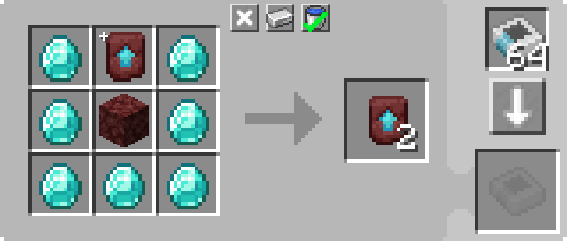

---
navigation:
  parent: example-setups/example-setups-index.md
  title: 再帰クラフト
  icon: minecraft:netherite_upgrade_smithing_template
---

# 再帰クラフト構成

[自動クラフト](../ae2-mechanics/autocrafting.md)で述べられている通り、自動クラフトの計画アルゴリズムは「最終出力が入力の一部になっているレシピ」を扱うことができません。
例えば<ItemLink id="minecraft:netherite_upgrade_smithing_template" />の複製のようなケースです。

この問題の解決方法の1つが、<ItemLink id="level_emitter" />が[パターン](../items-blocks-machines/patterns.md)のように振る舞う機能を利用する方法です。

これにより、クラフトを継続的に実行する小さな仕組みをオンにすることができます。ここでは<ItemLink id="minecraft:netherite_upgrade_smithing_template" />の複製構成を例にします。

<RecipeFor id="minecraft:netherite_upgrade_smithing_template" />

***

<GameScene zoom="6" interactive={true}>
  <ImportStructure src="../assets/assemblies/recursive_recipe_setup.snbt" />

  <BoxAnnotation color="#dddddd" min="1 0 0" max="2 1 1">
        (1) MEインターフェース：必要な追加材料（ダイヤモンドとネザーラック）をストックする設定
        <Row><ItemImage id="minecraft:diamond" scale="2" /> <ItemImage id="minecraft:netherrack" scale="2" /></Row>
  </BoxAnnotation>

  <BoxAnnotation color="#dddddd" min="2.3 1 0.3" max="2.7 1.3 0.7">
        (2) レベルエミッタ：対象「ネザライト強化テンプレート」に設定、「クラフト時にレッドストーン出力」に設定
        <Row><ItemImage id="minecraft:netherite_upgrade_smithing_template" scale="2" /> <ItemImage id="crafting_card" scale="2" /></Row>
  </BoxAnnotation>

  <BoxAnnotation color="#dddddd" min="2 0 0" max="2.3 1 1">
        (3) MEインポートバス #1：MEインターフェースが供給するアイテムにフィルタ設定。レッドストーンカード装備。「信号有効時に動作」モード
        <Row>
        <ItemImage id="minecraft:diamond" scale="2" />
        <ItemImage id="minecraft:netherrack" scale="2" />
        <ItemImage id="redstone_card" scale="2" />
        </Row>
  </BoxAnnotation>

  <BoxAnnotation color="#dddddd" min="3 1 1" max="4 1.3 2">
        (4) MEストレージバス #1：他のMEストレージバスより高い優先度に設定（非常に重要）
  </BoxAnnotation>

  <BoxAnnotation color="#dddddd" min="3 0 1" max="4 1 2">
        (5) 分子組立機：ネザライトテンプレート複製用パターンを内蔵

        

        また、構築時に手動で1つテンプレートを内部に入れておく必要があります。
  </BoxAnnotation>

  <BoxAnnotation color="#dddddd" min="2.7 0 1" max="3 1 2">
        (6) MEインポートバス #2：デフォルト設定
  </BoxAnnotation>

  <BoxAnnotation color="#dddddd" min="1 0 1" max="2 1 1.3">
        (7) MEストレージバス #2：「ネザライト強化テンプレート」にフィルタ設定。もう一方より低い優先度
        <ItemImage id="minecraft:netherite_upgrade_smithing_template" scale="2" />
  </BoxAnnotation>

<DiamondAnnotation pos="0 0.5 0.5" color="#00ff00">
        メインネットワークへ
    </DiamondAnnotation>

  <IsometricCamera yaw="15" pitch="30" />
</GameScene>

## 構成設定

* <ItemLink id="interface" />（1）：追加材料としてダイヤモンドとネザーラックをストックする設定
* <ItemLink id="level_emitter" />（2）：「ネザライト強化テンプレート」に設定し、「クラフト時にレッドストーン出力」に設定
* 最初の<ItemLink id="import_bus" />（3）：MEインターフェースが供給するアイテムにフィルタ設定。レッドストーンカード装備。「信号有効時に動作」
* 最初の<ItemLink id="storage_bus" />（4）：もう一方より**高い**[優先度](../ae2-mechanics/import-export-storage.md#storage-priority)に設定
* <ItemLink id="molecular_assembler" />（5）：テンプレート複製パターンを内蔵し、初期状態でテンプレートを1つ手動投入

  

* 2つ目の<ItemLink id="import_bus" />（6）：デフォルト設定
* 2つ目の<ItemLink id="storage_bus" />（7）：ネザライト強化テンプレートにフィルタ設定。もう一方より**低い**[優先度](../ae2-mechanics/import-export-storage.md#storage-priority)

## 動作原理

1. <ItemLink id="level_emitter" />は<ItemLink id="crafting_card" />により[パターン](../items-blocks-machines/patterns.md)として振る舞い、「ネザライト強化テンプレート」が[端末](../items-blocks-machines/terminals.md)で自動クラフト可能になる
2. クラフト要求（プレイヤーまたはシステム）を受けるとレベルエミッタがオンになる
3. 最初の<ItemLink id="import_bus" />がレベルエミッタにより有効化され、MEインターフェースの材料を引き出す
4. それらの材料を保存できるネットワーク上の唯一のストレージは分子組立機側のMEストレージバスである
5. <ItemLink id="molecular_assembler" />は材料を受け取り（内部に既にテンプレートを1つ保持した状態で）、クラフトを実行し2つのテンプレートを生成する
6. 2つ目の<ItemLink id="import_bus" />がテンプレートを1つ回収する
7. 高優先度のMEストレージバスがあるため、そのテンプレートは分子組立機へ戻される
8. 2つ目の<ItemLink id="import_bus" />がさらにもう1つテンプレートを回収する
9. 分子組立機はこれ以上テンプレートを受け取れないため、余ったテンプレートは低優先度MEストレージバスへ送られ、MEインターフェースに入る
10. <ItemLink id="interface" />はテンプレートを保管対象としていないため、それをネットワークへ出力する
