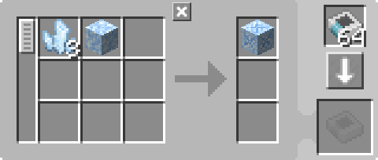
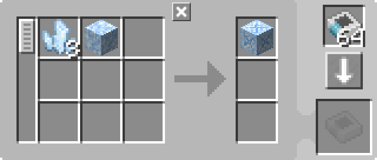

---
navigation:
  parent: example-setups/example-setups-index.md
  title: 水投入自動化
  icon: fluix_crystal
---

# 水に投げ込むレシピの自動化

この構成は<ItemLink id="pattern_provider" />を使用するため、[自動クラフト](../ae2-mechanics/autocrafting.md)システムへの統合を前提としています。

一部のレシピではアイテムを水中に投げ込む必要があります（同様の仕組みで他の場所へ投げることも可能です）。
これらは<ItemLink id="formation_plane" />と<ItemLink id="annihilation_plane" />、および補助構造を組み合わせることで自動化できます（本質的には2つの改造された[パイプサブネット](pipe-subnet.md)です）。

この構成は、<ItemLink id="charged_certus_quartz_crystal" />を供給するための[チャージャー自動化](charger-automation.md)と併用することを想定しています。

<GameScene zoom="6" interactive={true}>
  <ImportStructure src="../assets/assemblies/throw_in_water.snbt" />

<BoxAnnotation color="#dddddd" min="2 0 1" max="3 1 2">
        (1) パターンプロバイダー：デフォルト設定。対応する処理パターンを保持

         
  </BoxAnnotation>

<BoxAnnotation color="#dddddd" min="1.7 0 1" max="2 1 2">
        (2) インターフェース：デフォルト設定
  </BoxAnnotation>

<BoxAnnotation color="#dddddd" min="1 .7 1" max="2 1 2">
        (3) フォーメーションプレーン：入力をアイテムとしてドロップする設定
  </BoxAnnotation>

<BoxAnnotation color="#dddddd" min="1 2 1" max="2 2.3 2">
        (4) アンナイレーションプレーン：GUIなしで設定不可
  </BoxAnnotation>

<BoxAnnotation color="#dddddd" min="2 1 1" max="3 1.3 2">
        (5) ストレージバス：パターンの出力にフィルタ設定
        <Row><ItemImage id="fluix_crystal" scale="2" /><BlockImage id="flawless_budding_quartz" scale="2" /></Row>
  </BoxAnnotation>

<DiamondAnnotation pos="3.9 0.5 1.5" color="#00ff00">
        メインネットワークおよびチャージャー自動化へ
        <GameScene zoom="3" background="transparent">
          <ImportStructure src="../assets/assemblies/charger_automation.snbt" />
          <IsometricCamera yaw="195" pitch="30" />
        </GameScene>
    </DiamondAnnotation>

  <IsometricCamera yaw="180" pitch="0" />
</GameScene>

## 設定とパターン

* <ItemLink id="pattern_provider" />（1）はデフォルト設定で、対応する[処理パターン](../items-blocks-machines/patterns.md)を保持
  * <ItemLink id="fluix_crystal" />についてはJEI/REIのデフォルトレシピで問題なく動作：

    

  * <ItemLink id="flawed_budding_quartz" />については、<ItemLink id="quartz_block" />から直接作成する形が推奨されます。
    これにより「あるレシピの出力が別レシピの入力になる」問題を回避でき、ストレージバスのフィルタリングが正しく機能します：

    

* <ItemLink id="interface" />（2）はデフォルト設定
* <ItemLink id="formation_plane" />（3）は入力をアイテムとしてドロップする設定
* <ItemLink id="annihilation_plane" />（4）はGUIなしで設定不可
* <ItemLink id="storage_bus" />（5）はパターンの出力に合わせてフィルタ設定

## 動作原理

1. <ItemLink id="pattern_provider" />が材料をサブネット側の<ItemLink id="interface" />へ送る（緑サブネット）
2. インターフェースはデフォルト設定により、内部に保持せずネットワークへ押し出そうとする
3. 緑サブネット上の唯一のストレージである<ItemLink id="formation_plane" />がそれを受け取り、水中へドロップする
4. オレンジサブネットの<ItemLink id="annihilation_plane" />がアイテムを回収しようとするが、上にある<ItemLink id="storage_bus" />が出力のみ許可しているため回収できない
5. アイテムは水中で変換処理を行う
6. 変換後、アンナイレーションプレーンが回収可能になる（ストレージバスが許可するため）
7. ストレージバスが結果アイテムをパターンプロバイダーへ格納し、ネットワークへ返す
