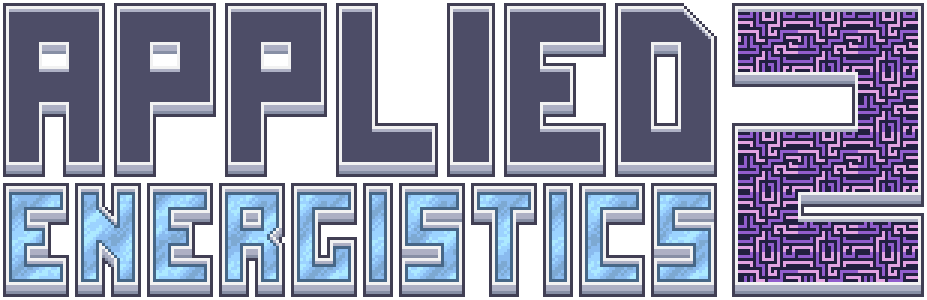

---
navigation:
  title: 目次
  position: 0
---

# Applied Energistics 2とは？

# このガイドの使い方

* 左側のサイドバーにアクセスして目次を見つけてください。
* 多くのページにはインタラクティブなシーンがあります。シーンにや（ズーム）ボタンがある場合、カメラを回転させたり移動させたりできます。
左クリックしてドラッグすると回転し、右クリックしてドラッグすると平行移動します。

# Applied Energistics 2とは？

Applied Energistics 2は、ロジスティクスとストレージのソリューションを提供するコンポーネントとメカニズムを追加します。チェストでいっぱいの広い部屋をコンパクトなMEネットワークに置き換えることができますが、それは始まりに過ぎません。
Applied Energisticsは、他のモッドと連携し、モッドパック内での自動化を可能にすることを目的としています。システムを設定すれば、複雑なクラフトチェーンのすべての前提条件（および最終結果）をワンクリックでクラフトしたり、必要に応じてアイテムを一定量在庫に保ったり、単に拠点内でアイテムを移動させたりすることができます。

* [はじめに](getting-started.md)
* [ヒントとコツ](tips-and-tricks.md)
* [AE2のメカニズム](ae2-mechanics/ae2-mechanics-index.md)
* [例のセットアップ](example-setups/example-setups-index.md)
* [アイテム、ブロック、機械](items-blocks-machines/items-blocks-machines-index.md)

<GameScene zoom="4" interactive={true}>
  <ImportStructure src="assets/assemblies/autocraft_setup_greebles.snbt" />
  <IsometricCamera yaw="195" pitch="30" />
</GameScene>
