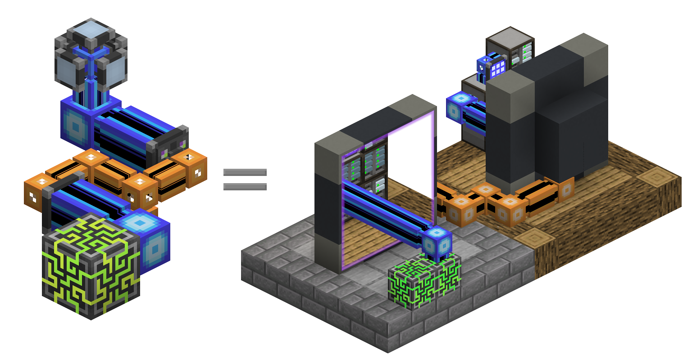

---
navigation:
  parent: items-blocks-machines/items-blocks-machines-index.md
  title: P2Pトンネル
  icon: me_p2p_tunnel
  position: 210
categories:
- devices
item_ids:
- ae2:me_p2p_tunnel
- ae2:redstone_p2p_tunnel
- ae2:item_p2p_tunnel
- ae2:fluid_p2p_tunnel
- ae2:fe_p2p_tunnel
- ae2:light_p2p_tunnel
---

# Point To Pointトンネル

<GameScene zoom="6" background="transparent">
  <ImportStructure src="../assets/assemblies/p2p_tunnels.snbt" />
  <IsometricCamera yaw="195" pitch="30" />
</GameScene>

P2Pトンネルは、アイテム、流体、レッドストーン信号、電力、光、[チャンネル](../ae2-mechanics/channels.md)などを、
それらをネットワークへ直接干渉させることなくネットワーク内で移動させる手段です。P2Pトンネルには多くの種類がありますが、
それぞれが対応する種類のものだけを転送します。基本的には、離れた2つのブロック面を直接接続する
ポータルのように機能します。双方向ではなく、入力側と出力側が明確に定義されています。

たとえば、アイテムP2Pに向いたホッパーは樽に直接接続されているかのように振る舞い、アイテムが流れます。

<GameScene zoom="4" background="transparent">
  <ImportStructure src="../assets/assemblies/p2p_hopper_barrel.snbt" />
  <IsometricCamera yaw="195" pitch="30" />
</GameScene>

ただし、2つの樽を隣接させても、互いにアイテムを転送することはできません。

<GameScene zoom="4" background="transparent">
  <ImportStructure src="../assets/assemblies/p2p_barrel_barrel.snbt" />
  <IsometricCamera yaw="195" pitch="30" />
</GameScene>

レッドストーンP2Pのような他の種類もあります。

<GameScene zoom="4" background="transparent">
  <ImportStructure src="../assets/assemblies/p2p_redstone.snbt" />
  <IsometricCamera yaw="195" pitch="30" />
</GameScene>

そして、チャンネルを移動させるME P2Pもあります。

<GameScene zoom="4" background="transparent">
  <ImportStructure src="../assets/assemblies/p2p_channels.snbt" />
  <IsometricCamera yaw="195" pitch="30" />
</GameScene>

## P2Pトンネルの種類と同調

<GameScene zoom="6" background="transparent">
  <ImportStructure src="../assets/assemblies/p2p_tunnels.snbt" />
  <IsometricCamera yaw="180" pitch="90" />
</GameScene>

P2Pトンネルには多くの種類があります。直接クラフトできるのはME P2Pトンネルのみで、他の種類は特定のアイテムを使って
別のP2Pトンネルを右クリックすることで作成します:
- ME P2Pトンネルは、任意の[ケーブル](../items-blocks-machines/cables.md)で右クリックして選択します。
- レッドストーンP2Pトンネルは、各種レッドストーン部品で右クリックして選択します。
- アイテムP2Pトンネルは、チェストまたはホッパーで右クリックして選択します。
- 流体P2Pトンネルは、バケツまたは瓶で右クリックして選択します。
- エネルギーP2Pトンネルは、ほぼすべてのエネルギーを含むアイテムで右クリックして選択します。
- 光P2Pトンネルは、松明またはグロウストーンで右クリックして選択します

一部のトンネル種類には癖があります。たとえば、ME P2Pトンネルのチャンネルは他のME P2Pトンネルを通過できず、
エネルギーP2Pトンネルは、自身の[エネルギー](../ae2-mechanics/energy.md)消費を増やすことで、
通過するFEに対して間接的に2.5%の税を課します。

## 最もよく使われるP2Pの形

P2Pトンネルの最も一般的な用途は、ME P2Pトンネルを使って[チャンネル](../ae2-mechanics/channels.md)輸送を高密度化することです。
高密度ケーブルの束を使う代わりに、1本の高密度ケーブルで大量のチャンネルを運べます。

この例では、8つのME P2P入力がメインネットワークの<ItemLink id="controller" />から256チャンネル(8*32)を受け取り、
8つのME P2P出力がそれを別の場所へ出力します。各P2Pトンネルの入力または出力が1チャンネルを消費している点に注目してください。
これにより、細いケーブル1本で大量のチャンネルを通せます。さらに、P2Pトンネルは専用の[サブネットワーク](../ae2-mechanics/subnetworks.md)上にあるため、
これを行うのにメインネットワーク側のチャンネルは一切消費しません！また、P2Pトンネルはコントローラーへ直接接続できますが、
チャンネルの可視化をしやすくするため、その間に[高密度スマートケーブル](../items-blocks-machines/cables.md#smart-cable)を挟むこともできます。

<GameScene zoom="4" interactive={true}>
  <ImportStructure src="../assets/assemblies/p2p_compact_channels.snbt" />

  <BoxAnnotation color="#dddddd" min="1.3 1.3 6.3" max="2 2.7 6.7">
        Quartz FiberはメインネットワークとP2Pサブネットワーク間で電力を共有します。
  </BoxAnnotation>

  <BoxAnnotation color="#dddddd" min="4.1 0 5.7" max="5 2.3 6.4">
        トンネル入力はコントローラーへ直接置くことも、ケーブル経由で接続することもできます。
  </BoxAnnotation>

  <IsometricCamera yaw="225" pitch="30" />
</GameScene>

別の例([量子ブリッジ](quantum_bridge.md)との併用例を含む)については、手直しする気が起きなかったこのMS Paint図を参照してください:

## ネスト

ただし、これを使って1本のケーブルへ無限にチャンネルを流すことはできません。ME P2Pトンネル用のチャンネルは
別のME P2Pトンネルを通過できないため、再帰的にネストすることはできません。赤いケーブル上にある外側のME P2Pトンネル層が
オフラインになっていることに注目してください。これはME P2Pトンネルにのみ適用され、他の種類のP2PトンネルはME P2Pトンネルを通過できます。
その例として、レッドストーンP2Pトンネルは正常に動作しています。

<GameScene zoom="4" background="transparent">
  <ImportStructure src="../assets/assemblies/p2p_nesting.snbt" />
  <IsometricCamera yaw="225" pitch="30" />
</GameScene>

## リンク

<GameScene zoom="6" background="transparent">
  <ImportStructure src="../assets/assemblies/p2p_linking_frequency.snbt" />
  <IsometricCamera yaw="195" pitch="30" />
</GameScene>

P2Pトンネル接続の両端は、<ItemLink id="memory_card" />を使ってリンクできます。周波数は
トンネル背面に2x2の色配列として表示されます。
- Shift+右クリックで新しいP2Pリンク周波数を生成します。
- 右クリックで設定、アップグレードカード、またはリンク周波数を貼り付けます。

Shift+右クリックしたトンネルが入力側になり、右クリックしたトンネルが出力側になります。出力側は複数設定できますが、
ME P2Pトンネルでは入力側に流れたチャンネルが各出力へ分配されるため、チャンネルを複製することはできません。

## レシピ

<RecipeFor id="me_p2p_tunnel" />
