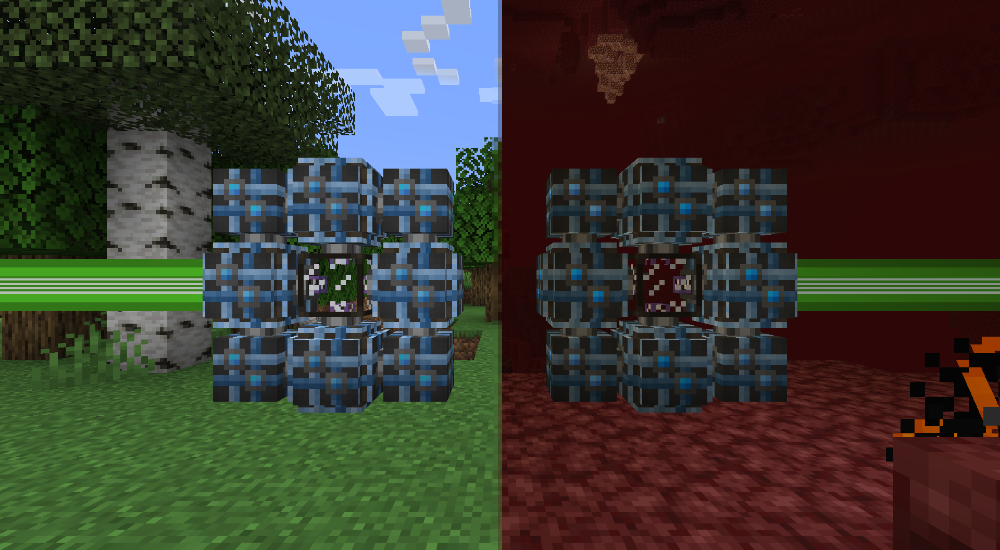

---
navigation:
  parent: items-blocks-machines/items-blocks-machines-index.md
  title: 量子ブリッジ
  icon: quantum_ring
  position: 110
categories:
- network infrastructure
item_ids:
- ae2:quantum_link
- ae2:quantum_ring
---

# 量子ネットワークブリッジ

量子ネットワークブリッジは、無限距離、さらには次元を越えて[ネットワーク](../ae2-mechanics/me-network-connections.md)を延長できます。
合計32チャンネルを伝送でき(各面へのケーブル接続方法に関係なく)、実質的にはワイヤレスな[高密度ケーブル](cables.md#dense-cable)として機能します。

<GameScene zoom="4" background="transparent">
  <ImportStructure src="../assets/assemblies/quantum_bridge_internal_structure_1.snbt" />
  <IsometricCamera yaw="195" pitch="30" />
</GameScene>

<GameScene zoom="4" background="transparent">
  <ImportStructure src="../assets/assemblies/quantum_bridge_internal_structure_2.snbt" />

  <BoxAnnotation color="#33dd33" min="1 1 1" max="6 2 3">
        2つの終端間にある仮想ケーブル
  </BoxAnnotation>

  <IsometricCamera yaw="195" pitch="30" />
</GameScene>

なお、**両側ともチャンクロードされている必要がある**ため、2つの端が離れている場合は<ItemLink id="spatial_anchor" />や他のチャンクローダーを使用する必要があります。

# 量子リング

<BlockImage id="quantum_ring" scale="8" />

これらのブロックを8個、<ItemLink id="quantum_link" />の周囲に配置すると量子ネットワークブリッジが作成されます。<ItemLink id="quantum_link" />に隣接する4つの<ItemLink id="quantum_ring" />ブロックのみがネットワーク接続を受け付け、4つの角のブロックにはケーブルを接続できません。

## レシピ

<RecipeFor id="quantum_ring" />

# 量子リンクチャンバー

<BlockImage id="quantum_link" scale="8" />

これらのブロック1つを<ItemLink id="quantum_ring" />で囲むと量子ネットワークブリッジが作成されます。このブロック自体はケーブルに接続されず、ブリッジが完全に形成されたときのみネットワークの一部として認識されます。

このブロックのインベントリには<ItemLink id="quantum_entangled_singularity" />を1つだけ保持でき、自動化アクセスに対応しています。

## レシピ

<RecipeFor id="quantum_link" />
